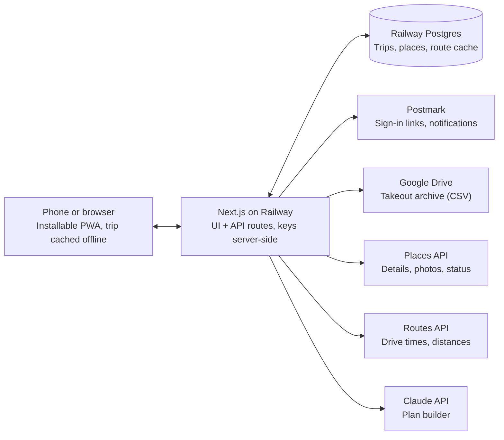

# Trip Planner — Build Spec for Claude Code

28 September 2026, Chief (updated with desktop and mobile layouts; stack updated to Railway, Postgres and Postmark)

## Overview

Build a mobile-first web app that turns saved Google Maps places into a day-by-day road trip plan you can edit, map and take offline. The first trip loaded is Tasmania, 18 January to 3 February 2027.

**Who it's for:** Chief (planner and driver) first, with read-only sharing for the family. Build it for one user now, but keep the data model multi-user so it can grow into a product later.

**The core loop:**

1. Save places in Google Maps as you research.
2. Hit **Sync** to pull those lists into the app.
3. Hit **Build plan** and have Claude slot the places into days around your fixed constraints (ferry, flights, who's travelling when).
4. Tweak by dragging stops between days, then take it on the road, including where there's no signal.

**Why not just use Google Maps:** Maps saves places but doesn't plan days, track legs (solo or family), hold permits and bookings, or warn you that a place is closed or a track needs a pass.

## Google connection and the Sync button

A Sync button is doable, but not as a live link: Google offers no API for Maps saved lists, so sync works through exports. [Google Maps has no export button, and the official route is Google Takeout, which delivers each saved list as a CSV](https://triplyplanner.com/blog/export-google-maps-saved-places). One catch: [Takeout only exports lists you created, not lists someone shared with you](https://github.com/ForceGT/gmaps-list-export).

**Sync works three ways, in order of preference:**

1. **Takeout via Google Drive (official, default).** Connect Google and grant read access to one Drive folder. Run Takeout (Saved + Maps) with delivery to Drive. **Sync** finds the newest archive in that folder, reads each list's CSV and imports it. It's reliable but not instant, so you re-run Takeout when you've added places.
2. **Paste a list share link (experimental).** The app reads the public share page and pulls the places. It's instant and works on shared lists, but it's unofficial scraping that Google can break at any time. Build it behind a feature flag with clear failure messages, and have it fall back to option 1.
3. **Upload a CSV or zip.** A manual fallback for when neither of the above works.

**After any import, the app enriches each place through the Google Places API:** place ID, coordinates, address, photos, opening hours and business status. Business status is what catches things like Montezuma Falls and Tasmans Arch showing as temporarily closed.

**Sync shows a diff before applying anything**, for example "4 new places, 1 removed, 2 now temporarily closed". New places go into an unscheduled tray rather than straight into days.

**Build plan** is a separate button. Sync only brings places in, and planning is always a deliberate step, so a sync never scrambles days you've already arranged.

Worth knowing: consumer apps like Triply already sell the share-link-to-itinerary flow, so if this becomes a product, differentiation needs to come from the road-trip specifics (legs, permits, 4WD, offline).

## Features by phase

Ship in four phases, each usable on its own, so the Tasmania trip is covered even if later phases slip.

### Phase 1 — Trip viewer and editor (MVP)

- The Tasmania trip loads from seed data (see Seed data) with days, stops, legs and notes.
- Map plus day timeline. Tapping a day shows its route and stops on the map, and tapping a stop highlights it.
- The whole trip shows as one continuous list, split by day. Stops can be dragged within and between days, and to and from a "Not yet scheduled" tray.
- Stops can be edited (name, day, arrival time, tags, notes, booking reference, link), added to a day, or moved back to the tray.
- Both layouts: the three-column desktop planning view and the mobile layout (see Screens and UX).
- Drive time and distance are shown between consecutive stops and as a daily total. A day over a set limit (default 5 hours) is flagged.
- Legs are shown as coloured bands across the timeline: Solo, Family and Solo.
- Each stop has a notes field and tags: 4WD, walk, camp, permit, book ahead and weather-dependent.
- A trip checklist covers permits, passes and bookings (Spirit of Tasmania, the Arthur-Pieman driver pass, the Parks pass, the West Coast Wilderness Railway, campsites), each with a status and due date.

### Phase 2 — Google sync

- Connect Google (OAuth, Drive `drive.file` scope). Sign-in itself stays on emailed links.
- Import through all three routes in the Google connection section.
- Places API enrichment and status flags: closed, temporarily closed, and hours that clash with the planned time.
- A sync diff screen, with new places going to the tray.
- Imported lists can be linked to a trip, for example the "Tasmania" list to the Tas trip.

### Phase 3 — AI plan builder

- **Build plan** turns the tray plus trip constraints into a suggested day-by-day plan.
- **Re-plan from here** reshuffles the remaining days after a disruption, for example "Climies is closed, rain for two days".
- **Suggest nearby** offers places near a day's route that aren't on your lists, clearly marked as suggestions.
- Every AI change arrives as a proposal you accept or reject, never a silent edit.

### Phase 4 — On the road

- An offline-capable PWA that caches the trip, days, stops, notes and checklist. This is essential, because the west coast has no signal.
- Read-only share link for the family, showing their leg only if chosen.
- One-tap "navigate to" into Google Maps or Apple Maps.
- Weather strip per day, plus a link to closure alerts (TasALERT, Parks and Wildlife).
- Trip notifications by email (Postmark), for example checklist items coming due.
- A second trip, created from a new Google list, which proves the app isn't Tasmania-specific.

## Tech stack and architecture

Use a standard, well-documented stack that Claude Code handles well and that costs close to nothing at one-user scale.

| Layer | Choice | Why |
| --- | --- | --- |
| App | Next.js (App Router), TypeScript, Tailwind | One codebase for the UI and API routes; installable as a PWA |
| Database | Railway Postgres, Drizzle ORM | Same project as the app; private network, no public DB endpoint |
| Auth | Auth.js (next-auth v4), emailed sign-in links, JWT sessions | Email allowlist; no passwords and no extra session tables |
| Email | Postmark, from the verified socialtap.com.au domain | Sign-in links and trip notifications |
| Map | Google Maps JavaScript API, with a Map ID for Advanced Markers | All maps are Google maps; Places data displayed on a Google map keeps within Google's terms |
| Place data | Places API (New) | Place ID, coordinates, photos, hours, business status |
| Drive times | Routes API | Leg-by-leg time and distance |
| Takeout access | Google Drive API, `drive.file` scope via Google Picker | The user picks the Takeout file, so the app never needs access to the whole Drive |
| AI | Claude API (Anthropic), called server-side | Plan builder and re-planning |
| Hosting | Railway | Deploys from GitHub `main`; runs `next start` as a Node service |

Every external call goes through the server's API routes. The one exception is the Maps JavaScript API, which has to load in the browser: it uses its own key, restricted to our domains and to that API only.

**Constraint for Claude Code to check:** Google Maps Platform terms limit caching Google content and showing Places data on non-Google maps. Offline mode should therefore cache the trip data (days, stops, notes, checklist) but not Google map tiles, and prompt the user to download offline areas in the Google Maps app before the trip. Check the current terms before building Phase 4.

## Data model

A place exists once per user and can be scheduled into many trips; a stop is a place on a specific day, or in the trip's tray.

| Table | Key fields | Notes |
| --- | --- | --- |
| `users` | id, name, email, home_region | Created on first sign-in |
| `trips` | id, owner_id, name, start_date, end_date, start_point, end_point, max_drive_hours_per_day | Tas trip: 18 Jan to 3 Feb 2027, Devonport to Devonport |
| `legs` | id, trip_id, name, start_date, end_date, travellers, colour | Solo 1, Family, Solo 2 |
| `fixed_events` | id, trip_id, type, datetime, location, notes | Ferry out/in, family flights in and out; the planner can't move these |
| `places` | id, user_id, google_place_id, name, lat, lng, address, business_status, photo_ref, hours_json, source_list, maps_url, last_enriched_at | One row per unique place per user |
| `place_lists` | id, user_id, name, source (takeout / share_link / csv), last_synced_at, trip_id (nullable) | Mirrors a Google list |
| `days` | id, trip_id, date, leg_id, overnight_place_id, notes | One row per calendar day |
| `stops` | id, trip_id, day_id (null means unscheduled), place_id, order, planned_time, duration_mins, tags[], notes, booking_ref, link, status (planned / done / skipped) | A stop with no day sits in the trip's "Not yet scheduled" tray and keeps its details. Tags: 4wd, walk, camp, permit, book_ahead, weather |
| `checklist_items` | id, trip_id, title, category, due_date, status, url, notes | Bookings, permits, passes |
| `sync_runs` | id, user_id, source, started_at, diff_json, applied | Audit trail and undo |
| `plan_proposals` | id, trip_id, created_at, prompt_json, proposal_json, status (pending / accepted / rejected) | Every AI suggestion is stored before it's applied |
| `shares` | id, trip_id, token, leg_filter, expires_at | Read-only family links |

Only the server talks to the database. Every query is scoped to the signed-in user, so you can only read and write rows you own, except a trip reached through a valid share token, which is read-only.

Places the user adds by hand, rather than through Google, are allowed and have `google_place_id` left empty. Tracks like Sandy Cape often don't resolve to a clean Google place.

## Screens and UX

The app has two layouts built on the same data. **Desktop is for planning** at a desk. **Mobile is for using the plan on the road.** Below 960px wide the app switches to the mobile layout.

The design references are in `/design`:

- `trip-planner-desktop.html` shows the desktop planning view.
- `trip-planner-mockups.html` shows the four mobile screens.

Match their layout, colours, type and behaviour, but rebuild them as proper components. Don't paste the mockup code in. The mockups' SVG maps are placeholders: every map in the app is a Google map.

### Desktop planning view (960px and wider)

A top bar holds the trip name, dates and the Sync from Google, Share and Build plan buttons. Below it are three columns, each scrolling on its own.

| Column | What it holds |
| --- | --- |
| Left rail (about 270px) | The legs with their dates. A list of every day with its leg colour, stop count and overnight; clicking a day scrolls the plan to it, and the day in view is highlighted. The "Not yet scheduled" tray of places from synced lists. |
| Plan (flexible, content capped at about 760px) | The whole trip as one continuous list, split by day. Each day header stays pinned while you scroll its stops and shows the date, leg and overnight. Under the header come the day's warnings, then its stops as cards, then an "Add a stop" button. |
| Side panel (about 400px) | For the day in view: a map with numbered, labelled pins, stat tiles (stops, overnight, driving time), the day's warnings and a "Due soon" checklist summary. When a stop is being edited, the editor replaces this panel so the plan stays visible. |

### Mobile layout (under 960px)

| Screen | What it does |
| --- | --- |
| Trip view | Map at the top, then a day strip that sticks to the top of the screen, then the whole trip as one continuous list split by date. Tapping a date scrolls to it, and the strip follows as you scroll. |
| Day view | One day in order, with drive legs between stops, warnings at the top, a Navigate button per stop and a plan B for weather-dependent days. |
| Sync | The diff of changes from Google, grouped into new, now closed and removed, with Apply and Cancel. |
| Checklist | Bookings and permits grouped by urgency, with due dates and a progress bar. |

On mobile, the stop editor opens as a bottom sheet.

### Stop interactions (both layouts)

- **Drag to reorder.** Stops can be dragged within a day, between days, and between the tray and any day. Numbering, warnings, day stop counts and the map update when a stop is dropped. An empty day shows a "Drag stops here" target. Use `sortablejs` from npm.
- **Touch.** On touch screens, a short press and hold (about 180ms) starts a drag, so a normal swipe still scrolls.
- **Edit.** An edit pencil appears when you hover over a stop, and is always visible on touch screens. The editor fields are name, day (a dropdown, which is another way to move a stop), arrival time, tags (4WD, Walk, Camp, Permit, Book ahead, Weather), notes, booking reference and link. Saved details show on the stop card.
- **Add a stop.** "Add a stop" opens the editor with a blank stop on that day. Cancelling a new stop removes it.
- **Unschedule.** "Move to not yet scheduled" sends a stop back to the tray, keeping its details.
- **Keyboard.** Esc closes the editor without saving, and Enter in a text field saves.

### Interaction rules

- Every AI or sync change appears as a diff to accept or reject, per day or all at once.
- Undo is always available for the last change.
- Warnings are quiet, like a small badge or banner, never a modal.
- Nothing requires signal to view. Edits made offline queue and sync when you're back online.
- The feel is calm, outdoorsy and legible in sunlight: high contrast, large tap targets and no clutter. Dark mode is for camp at night.

### Visual tokens (from the mockups)

| Token | Light | Dark | Used for |
| --- | --- | --- | --- |
| Myrtle | #2F6B4F | #62B08A | First solo leg; done states |
| Lichen | #C75A1C | #F0894A | Family leg |
| Ocean | #1F5A7A | #62A8D0 | Second solo leg; focus rings and links |
| Ink | #17272B | #E4ECEA | Text; primary buttons |
| Background | #E9EEEC | #0E181A | Page background |

The typefaces are Barlow Condensed for dates and headings, and Atkinson Hyperlegible for everything else, chosen for readability in sunlight. Leg colours are assigned per leg, so a new trip gets its own set.

## AI plan builder

Claude proposes the plan and the server checks it; nothing reaches the trip until the checks pass and the user accepts.

**What goes into the request:**

- Trip dates, start and end points, and legs with their travellers.
- Fixed events (ferry, flights) as hard anchors.
- Places, each with coordinates, tags, business status, hours and any note from the Google list.
- Days already arranged and marked "locked" by the user, which must not change.
- Preferences: maximum drive hours per day, pace, and rules like "hard 4WD tracks only on solo legs", "leave a weather buffer day before hard 4WD days" and "Salamanca Market is Saturdays only".

**What comes back:** JSON only, validated against a schema in code: for each day, the date, stops (place ID, order, suggested time, duration) and overnight location, plus a list of places left out, each with a one-line reason, and any warnings.

**Server checks before showing the proposal:**

1. Every fixed event and locked day is untouched.
2. Drive times from the Routes API are within the daily limit. If not, the server sends the violations back to Claude for one retry, then shows whatever still fails as warnings.
3. No temporarily closed place is scheduled without a warning.
4. No place is invented. Suggestions not on the user's lists are only allowed through "Suggest nearby" and are labelled.

**Prompting notes for Claude Code:**

- Keep the system prompt in `/prompts/plan-builder.md` so it can be tuned without code changes.
- Set the model through an environment variable (for example `claude-sonnet-5`) so it can be switched without a deploy.
- Store every request and response in `plan_proposals` to debug bad plans.
- Re-plan from here sends only the remaining days, the current position and the disruption in plain words.

## Seed data: Tasmania, January 2027

Claude Code should turn this table into `/seed/tasmania-2027.json` and a seed script, so Phase 1 opens with the real trip.

**Fixed events:** Spirit of Tasmania arrives in Devonport on 18 January. The family flies in on 21 January (currently assumed to be into Hobart) and out on 26 January (assumed to be from Launceston). The Spirit departs Devonport on 3 February.

| Date | Leg | Stops | Overnight | Tags |
| --- | --- | --- | --- | --- |
| Mon 18 Jan | Solo 1 | Devonport, Central Plateau lakes | Tungatinah Lagoon | 4wd, camp |
| Tue 19 Jan | Solo 1 | Mt Field (Horseshoe Falls, Russell Falls), Cockle Creek | Cockle Creek | walk, camp |
| Wed 20 Jan | Solo 1 | Cockle Creek, Hobart | Hobart | |
| Thu 21 Jan | Family | Hobart airport, Tasman Peninsula | Fortescue Bay | camp, book_ahead |
| Fri 22 Jan | Family | Cape Hauy, Tasmans Arch, Remarkable Cave, Tessellated Pavement, kunanyi/Mt Wellington | Hobart | walk, weather |
| Sat 23 Jan | Family | Salamanca Market, Coles Bay, Cape Tourville | Coles Bay | book_ahead |
| Sun 24 Jan | Family | Wineglass Bay or Mt Amos, Bluestone Bay, Bicheno Blowhole, Redbill Beach | Lagoons Beach or Bicheno | 4wd, walk |
| Mon 25 Jan | Family | St Helens, Binalong Bay, Bay of Fires (Cosy Corner, Sloop Reef), Halls Falls | Launceston | |
| Tue 26 Jan | Solo 2 | Launceston airport, Cradle Mountain | Cradle Mountain | |
| Wed 27 Jan | Solo 2 | Hansons Peak, Tullah, Lake Rosebery | Lake Gairdner | walk, camp |
| Thu 28 Jan | Solo 2 | Montezuma Falls, Queenstown, Horsetail Falls, Nelson Falls | Strahan | walk |
| Fri 29 Jan | Solo 2 | West Coast Wilderness Railway (return from Strahan) | Strahan | book_ahead |
| Sat 30 Jan | Solo 2 | Trial Harbour, Climies Track, Granville Harbour, Corinna | Corinna | 4wd, weather |
| Sun 31 Jan | Solo 2 | Fatman Barge, Western Explorer, Arthur River | Arthur River | 4wd, permit |
| Mon 1 Feb | Solo 2 | Sandy Cape Track | Sandy Cape | 4wd, camp, weather |
| Tue 2 Feb | Solo 2 | Arthur River, Stanley | Devonport | |
| Wed 3 Feb | Solo 2 | Spirit of Tasmania | — | |

**Flags to seed:** Montezuma Falls and Tasmans Arch as temporarily closed (to be re-checked by enrichment). "Peppermint Campground" goes to the tray, unscheduled, because its location isn't confirmed. The desktop mockup's tray also holds Lime Bay State Reserve and Cape Raoul Track (an alternative to Cape Hauy), which the Phase 1 acceptance criteria use.

**Checklist to seed:**

- [ ] Spirit of Tasmania return crossing (4WD)
- [ ] Family flights: into Hobart 21 Jan, out of Launceston 26 Jan
- [ ] Tasmanian Parks Holiday Pass
- [ ] Arthur-Pieman Recreational Driver Pass
- [ ] Fortescue Bay campsite
- [ ] Coles Bay or Bicheno accommodation
- [ ] West Coast Wilderness Railway tickets
- [ ] Corinna accommodation
- [ ] PLB or satellite messenger, and UHF radio

## Acceptance criteria and handover

Each phase is done when a real person can do the things below on a phone.

**Phase 1:**

- On a desktop browser, opening the app shows the three-column planning view with the Tasmania trip, all 17 days, three leg colours and the map.
- Clicking a day in the left rail scrolls the plan to that day, and scrolling the plan highlights the day in view and updates the side panel.
- Dragging Nelson Falls from 28 January to 20 January updates both days' numbering, stop counts and drive times within 2 seconds.
- Dragging Cape Raoul Track from the tray onto 22 January schedules it there; "Move to not yet scheduled" sends it back with its notes intact.
- Hovering over a stop shows the edit pencil; saving a note and booking reference shows both on the stop card after a reload.
- Narrowing the window below 960px switches to the mobile layout, where press and hold drags a stop and a normal swipe scrolls.
- A day over 5 hours of driving shows a warning badge.
- Checklist items can be ticked, and the ticks persist after a reload.

**Phase 2:**

- After connecting Google and picking a Takeout archive from Drive, the "Tasmania" list imports with the correct place count.
- A place saved in Google Maps after the last sync shows as "1 new" on the next sync and lands in the tray.
- A place Google reports as temporarily closed shows the closed flag.

**Phase 3:**

- Build plan with the three legs and fixed events locked returns a plan in under 60 seconds that breaks no hard constraint.
- Rejecting a proposal leaves the trip exactly as it was.

**Phase 4:**

- With the phone in flight mode, the trip, days, notes and checklist are all viewable.
- The family share link opens without a login and can't edit.

**Out of scope for now:** booking or payments inside the app, live GPS tracking, multi-user editing, and a native iOS or Android app.

**Open questions:**

- Are the family flights confirmed as Hobart in and Launceston out?
- Is this for personal use only, or a possible Social Tap product? The answer changes how much to invest in multi-user and branding.

**How to brief Claude Code:**

1. Create an empty repo. Save this file as `SPEC.md` at the root, and put `trip-planner-desktop.html` and `trip-planner-mockups.html` in a `/design` folder.
2. Ask Claude Code to read `SPEC.md` and open both design files, propose a file structure and a Phase 1 task list, and wait for approval before writing code.
3. Build one phase at a time. Ask it to write the seed data and a short `CLAUDE.md` with run and test commands first.
4. Keep API keys in `.env.local`, and never commit them.
5. At the end of each phase, test against the acceptance criteria above on your phone before starting the next phase.
