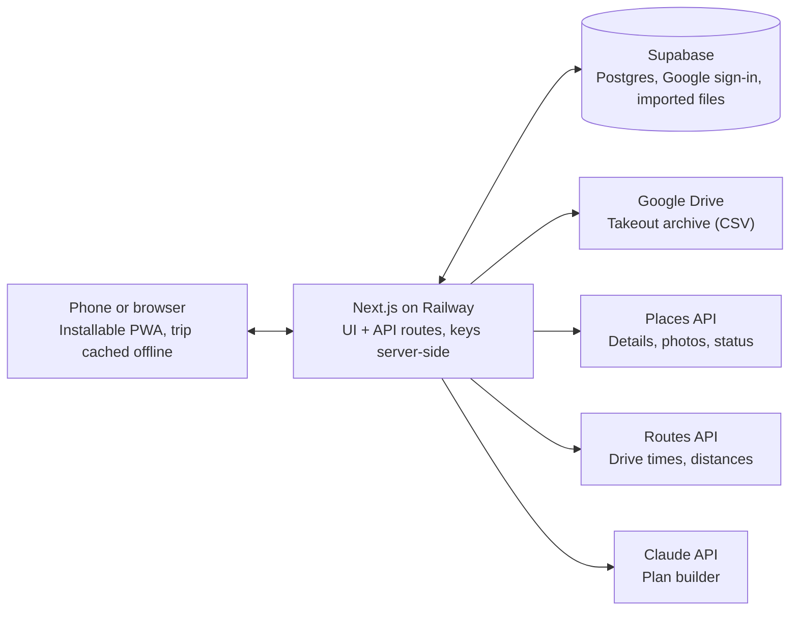

# Trip Planner — Build Spec for Claude Code

28 September 2026 · Chief

## Overview

Build a mobile-first web app that turns saved Google Maps places into a day-by-day road trip plan you can edit, map and take offline. The first trip loaded is Tasmania, 18 January to 3 February 2027.

**Who it's for:** Chief (planner and driver) first, with read-only sharing for the family. Build it for one user now, but keep the data model multi-user so it can grow into a product later.

**The core loop:**

1. Save places in Google Maps as you research.
2. Hit **Sync** to pull those lists into the app.
3. Hit **Build plan** and have Claude slot the places into days around your fixed constraints (ferry, flights, who's travelling when).
4. Tweak by dragging stops between days, then take it on the road, including where there's no signal.

**Why not just use Google Maps:** Maps saves places but doesn't plan days, track legs (solo or family), hold permits and bookings, or warn you that a place is closed or a track needs a pass.

## Google connection and the Sync button

A Sync button is doable, but not as a live link: Google offers no API for Maps saved lists, so sync works through exports. [Google Maps has no export button, and the official route is Google Takeout, which delivers each saved list as a CSV](https://triplyplanner.com/blog/export-google-maps-saved-places). One catch: [Takeout only exports lists you created, not lists someone shared with you](https://github.com/ForceGT/gmaps-list-export).

**Sync works three ways, in order of preference:**

1. **Takeout via Google Drive (official, default).** Sign in with Google and grant read access to one Drive folder. Run Takeout (Saved + Maps) with delivery to Drive. **Sync** finds the newest archive in that folder, reads each list's CSV and imports it. It's reliable but not instant, so you re-run Takeout when you've added places.
2. **Paste a list share link (experimental).** The app reads the public share page and pulls the places. It's instant and works on shared lists, but it's unofficial scraping that Google can break at any time. Build it behind a feature flag with clear failure messages, and have it fall back to option 1.
3. **Upload a CSV or zip.** A manual fallback for when neither of the above works.

**After any import, the app enriches each place through the Google Places API:** place ID, coordinates, address, photos, opening hours and business status. Business status is what catches things like Montezuma Falls and Tasmans Arch showing as temporarily closed.

**Sync shows a diff before applying anything**, for example "4 new places, 1 removed, 2 now temporarily closed". New places go into an unscheduled tray rather than straight into days.

**Build plan** is a separate button. Sync only brings places in, and planning is always a deliberate step, so a sync never scrambles days you've already arranged.

Worth knowing: consumer apps like Triply already sell the share-link-to-itinerary flow, so if this becomes a product, differentiation needs to come from the road-trip specifics (legs, permits, 4WD, offline).

## Features by phase

Ship in four phases, each usable on its own, so the Tasmania trip is covered even if later phases slip.

### Phase 1 — Trip viewer and editor (MVP)

- The Tasmania trip loads from seed data (see Seed data) with days, stops, legs and notes.
- Map plus day timeline. Tapping a day shows its route and stops on the map, and tapping a stop highlights it.
- Stops can be dragged within and between days, and there's an unscheduled tray for places not yet placed.
- Drive time and distance are shown between consecutive stops and as a daily total. A day over a set limit (default 5 hours) is flagged.
- Legs are shown as coloured bands across the timeline: Solo, Family and Solo.
- Each stop has a notes field and tags: 4WD, walk, camp, permit, book ahead and weather-dependent.
- A trip checklist covers permits, passes and bookings (Spirit of Tasmania, the Arthur-Pieman driver pass, the Parks pass, the West Coast Wilderness Railway, campsites), each with a status and due date.
- Mobile-first layout.

### Phase 2 — Google sync

- Google sign-in.
- Import through all three routes in the Google connection section.
- Places API enrichment and status flags: closed, temporarily closed, and hours that clash with the planned time.
- A sync diff screen, with new places going to the tray.
- Imported lists can be linked to a trip, for example the "Tasmania" list to the Tas trip.

### Phase 3 — AI plan builder

- **Build plan** turns the tray plus trip constraints into a suggested day-by-day plan.
- **Re-plan from here** reshuffles the remaining days after a disruption, for example "Climies is closed, rain for two days".
- **Suggest nearby** offers places near a day's route that aren't on your lists, clearly marked as suggestions.
- Every AI change arrives as a proposal you accept or reject, never a silent edit.

### Phase 4 — On the road

- An offline-capable PWA that caches the trip, days, stops, notes and checklist. This is essential, because the west coast has no signal.
- Read-only share link for the family, showing their leg only if chosen.
- One-tap "navigate to" into Google Maps or Apple Maps.
- Weather strip per day, plus a link to closure alerts (TasALERT, Parks and Wildlife).
- A second trip, created from a new Google list, which proves the app isn't Tasmania-specific.

## Tech stack and architecture

Use a standard, well-documented stack that Claude Code handles well and that costs close to nothing at one-user scale.

| Layer | Choice | Why |
| --- | --- | --- |
| App | Next.js (App Router), TypeScript, Tailwind | One codebase for the UI and API routes; installable as a PWA |
| Database and auth | Supabase (Postgres, Google sign-in, storage, row-level security) | Google login built in; row-level security keeps each user's trips private |
| Map | Google Maps JavaScript API | Places data displayed on a Google map keeps within Google's terms |
| Place data | Places API (New) | Place ID, coordinates, photos, hours, business status |
| Drive times | Routes API | Leg-by-leg time and distance |
| Takeout access | Google Drive API, `drive.file` scope via Google Picker | The user picks the Takeout file, so the app never needs access to the whole Drive |
| AI | Claude API (Anthropic), called server-side | Plan builder and re-planning |
| Hosting | Railway | Deploys from GitHub `main`; runs `next start` as a Node service |

The browser never holds a Google or Anthropic key; every external call goes through the server's API routes.

**Constraint for Claude Code to check:** Google Maps Platform terms limit caching Google content and showing Places data on non-Google maps. Offline mode should therefore cache the trip data (days, stops, notes, checklist) but not Google map tiles, and prompt the user to download offline areas in the Google Maps app before the trip. Check the current terms before building Phase 4.

## Data model

A place exists once per user and can be scheduled into many trips; a stop is a place on a specific day.

| Table | Key fields | Notes |
| --- | --- | --- |
| `users` | id, name, email, home_region | From Supabase auth |
| `trips` | id, owner_id, name, start_date, end_date, start_point, end_point, max_drive_hours_per_day | Tas trip: 18 Jan to 3 Feb 2027, Devonport to Devonport |
| `legs` | id, trip_id, name, start_date, end_date, travellers, colour | Solo 1, Family, Solo 2 |
| `fixed_events` | id, trip_id, type, datetime, location, notes | Ferry out/in, family flights in and out; the planner can't move these |
| `places` | id, user_id, google_place_id, name, lat, lng, address, business_status, photo_ref, hours_json, source_list, maps_url, last_enriched_at | One row per unique place per user |
| `place_lists` | id, user_id, name, source (takeout / share_link / csv), last_synced_at, trip_id (nullable) | Mirrors a Google list |
| `days` | id, trip_id, date, leg_id, overnight_place_id, notes | One row per calendar day |
| `stops` | id, day_id, place_id, order, planned_time, duration_mins, tags[], notes, status (planned / done / skipped) | Tags: 4wd, walk, camp, permit, book_ahead, weather |
| `checklist_items` | id, trip_id, title, category, due_date, status, url, notes | Bookings, permits, passes |
| `sync_runs` | id, user_id, source, started_at, diff_json, applied | Audit trail and undo |
| `plan_proposals` | id, trip_id, created_at, prompt_json, proposal_json, status (pending / accepted / rejected) | Every AI suggestion is stored before it's applied |
| `shares` | id, trip_id, token, leg_filter, expires_at | Read-only family links |

Row-level security applies to every table: you can only read and write rows you own, except a trip reached through a valid share token, which is read-only.

Places the user adds by hand, rather than through Google, are allowed and have `google_place_id` left empty. Tracks like Sandy Cape often don't resolve to a clean Google place.

## Screens and UX

Five screens, designed phone-first: most use is one-handed in a car park or a campsite.

| Screen | What it does |
| --- | --- |
| Trips | Trip cards with dates, legs and a thumbnail map. "New trip from a Google list" starts here. |
| Trip view | The main screen. Map on top (half screen on phone, left pane on desktop), a horizontally scrolling day strip, then the selected day's stops. Leg colours run along the day strip. Buttons: Sync, Build plan, Share. |
| Day view | Stops in order with drive time between each, tags as chips, notes, and a "navigate" button. Warnings sit at the top: over the drive-time limit, a closed place, a permit not yet done. |
| Tray | Unscheduled places from synced lists, filterable by list and tag, which you drag onto a day. |
| Checklist | Bookings and permits grouped by status, with due dates. Things due in the next 14 days show on the Trip view. |

The interaction rules:

- Every AI or sync change appears as a diff to accept or reject, per day or all at once.
- Undo is always available for the last change.
- Warnings are quiet, like a small badge, not a modal.
- Nothing requires signal to view. Edits made offline queue and sync when you're back online.
- The feel is calm, outdoorsy and legible in sunlight: high contrast, large tap targets and no clutter. Dark mode is for camp at night.

## AI plan builder

Claude proposes the plan and the server checks it; nothing reaches the trip until the checks pass and the user accepts.

**What goes into the request:**

- Trip dates, start and end points, and legs with their travellers.
- Fixed events (ferry, flights) as hard anchors.
- Places, each with coordinates, tags, business status, hours and any note from the Google list.
- Days already arranged and marked "locked" by the user, which must not change.
- Preferences: maximum drive hours per day, pace, and rules like "hard 4WD tracks only on solo legs", "leave a weather buffer day before hard 4WD days" and "Salamanca Market is Saturdays only".

**What comes back:** JSON only, validated against a schema in code: for each day, the date, stops (place ID, order, suggested time, duration) and overnight location, plus a list of places left out, each with a one-line reason, and any warnings.

**Server checks before showing the proposal:**

1. Every fixed event and locked day is untouched.
2. Drive times from the Routes API are within the daily limit. If not, the server sends the violations back to Claude for one retry, then shows whatever still fails as warnings.
3. No temporarily closed place is scheduled without a warning.
4. No place is invented. Suggestions not on the user's lists are only allowed through "Suggest nearby" and are labelled.

**Prompting notes for Claude Code:**

- Keep the system prompt in `/prompts/plan-builder.md` so it can be tuned without code changes.
- Set the model through an environment variable (for example `claude-sonnet-5`) so it can be switched without a deploy.
- Store every request and response in `plan_proposals` to debug bad plans.
- Re-plan from here sends only the remaining days, the current position and the disruption in plain words.

## Seed data: Tasmania, January 2027

Claude Code should turn this table into `/seed/tasmania-2027.json` and a seed script, so Phase 1 opens with the real trip.

**Fixed events:** Spirit of Tasmania arrives in Devonport on 18 January. The family flies in on 21 January (currently assumed to be into Hobart) and out on 26 January (assumed to be from Launceston). The Spirit departs Devonport on 3 February.

| Date | Leg | Stops | Overnight | Tags |
| --- | --- | --- | --- | --- |
| Mon 18 Jan | Solo 1 | Devonport, Central Plateau lakes | Tungatinah Lagoon | 4wd, camp |
| Tue 19 Jan | Solo 1 | Mt Field (Horseshoe Falls, Russell Falls), Cockle Creek | Cockle Creek | walk, camp |
| Wed 20 Jan | Solo 1 | Cockle Creek, Hobart | Hobart | |
| Thu 21 Jan | Family | Hobart airport, Tasman Peninsula | Fortescue Bay | camp, book_ahead |
| Fri 22 Jan | Family | Cape Hauy, Tasmans Arch, Remarkable Cave, Tessellated Pavement, kunanyi/Mt Wellington | Hobart | walk, weather |
| Sat 23 Jan | Family | Salamanca Market, Coles Bay, Cape Tourville | Coles Bay | book_ahead |
| Sun 24 Jan | Family | Wineglass Bay or Mt Amos, Bluestone Bay, Bicheno Blowhole, Redbill Beach | Lagoons Beach or Bicheno | 4wd, walk |
| Mon 25 Jan | Family | St Helens, Binalong Bay, Bay of Fires (Cosy Corner, Sloop Reef), Halls Falls | Launceston | |
| Tue 26 Jan | Solo 2 | Launceston airport, Cradle Mountain | Cradle Mountain | |
| Wed 27 Jan | Solo 2 | Hansons Peak, Tullah, Lake Rosebery | Lake Gairdner | walk, camp |
| Thu 28 Jan | Solo 2 | Montezuma Falls, Queenstown, Horsetail Falls, Nelson Falls | Strahan | walk |
| Fri 29 Jan | Solo 2 | West Coast Wilderness Railway (return from Strahan) | Strahan | book_ahead |
| Sat 30 Jan | Solo 2 | Trial Harbour, Climies Track, Granville Harbour, Corinna | Corinna | 4wd, weather |
| Sun 31 Jan | Solo 2 | Fatman Barge, Western Explorer, Arthur River | Arthur River | 4wd, permit |
| Mon 1 Feb | Solo 2 | Sandy Cape Track | Sandy Cape | 4wd, camp, weather |
| Tue 2 Feb | Solo 2 | Arthur River, Stanley | Devonport | |
| Wed 3 Feb | Solo 2 | Spirit of Tasmania | — | |

**Flags to seed:** Montezuma Falls and Tasmans Arch as temporarily closed (to be re-checked by enrichment). "Peppermint Campground" goes to the tray, unscheduled, because its location isn't confirmed.

**Checklist to seed:**

- [ ] Spirit of Tasmania return crossing (4WD)
- [ ] Family flights: into Hobart 21 Jan, out of Launceston 26 Jan
- [ ] Tasmanian Parks Holiday Pass
- [ ] Arthur-Pieman Recreational Driver Pass
- [ ] Fortescue Bay campsite
- [ ] Coles Bay or Bicheno accommodation
- [ ] West Coast Wilderness Railway tickets
- [ ] Corinna accommodation
- [ ] PLB or satellite messenger, and UHF radio

## Acceptance criteria and handover

Each phase is done when a real person can do the things below on a phone.

**Phase 1:**

- Opening the app shows the Tasmania trip with all 17 days, three leg colours and the map.
- Dragging Nelson Falls from 28 January to 20 January updates both days' drive times within 2 seconds.
- A day over 5 hours of driving shows a warning badge.
- Checklist items can be ticked, and the ticks persist after a reload.

**Phase 2:**

- After signing in with Google and picking a Takeout archive from Drive, the "Tasmania" list imports with the correct place count.
- A place saved in Google Maps after the last sync shows as "1 new" on the next sync and lands in the tray.
- A place Google reports as temporarily closed shows the closed flag.

**Phase 3:**

- Build plan with the three legs and fixed events locked returns a plan in under 60 seconds that breaks no hard constraint.
- Rejecting a proposal leaves the trip exactly as it was.

**Phase 4:**

- With the phone in flight mode, the trip, days, notes and checklist are all viewable.
- The family share link opens without a login and can't edit.

**Out of scope for now:** booking or payments inside the app, live GPS tracking, multi-user editing, and a native iOS or Android app.

**Open questions:**

- Are the family flights confirmed as Hobart in and Launceston out?
- Is this for personal use only, or a possible Social Tap product? The answer changes how much to invest in multi-user and branding.
- Is a Google Cloud project with billing already set up? Places and Routes need one, though the free monthly credit should cover one user.

**How to brief Claude Code:**

1. Create an empty repo and save this file as `SPEC.md` at the root.
2. Ask Claude Code to read `SPEC.md`, propose a file structure and a Phase 1 task list, and wait for approval before writing code.
3. Build one phase at a time. Ask it to write the seed data and a short `CLAUDE.md` with run and test commands first.
4. Keep API keys in `.env.local`, and never commit them.
5. At the end of each phase, test against the acceptance criteria above on your phone before starting the next phase.
